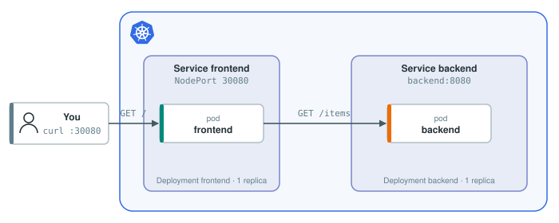

# Chaos Engineering: Testing How Your Service Behaves When a Dependency Fails

## Introduction

Chaos engineering is the practice of deliberately injecting failures into a running system, for example cutting the network to a dependency, to find out how it really behaves before your users find out for you. These failures are hard to test any other way: a mock can return an error, but it does not reproduce a request that hangs forever.

It lets you model the scenarios you never want to happen, like the database crashing, in a controlled way, and check that the application degrades gracefully instead of falling over. Sometimes that is a one-off exercise, but since resilience regresses as quietly as any other property (a refactor drops a timeout, say), the experiments can also be written as code and run in the delivery pipeline like any other test, so a change that makes the system fragile is caught before it reaches users.

## What you will do

Chaos engineering follows a simple loop: state a hypothesis about what happens when a certain failure occurs, inject that failure, and check whether the system still behaves as the hypothesis says. If it does not, fix the system and run the same experiment again. In this tutorial you will:

1. Kill a backend pod with Chaos Mesh and find out whether users notice.
2. Cut the network between the frontend and the backend and see what a missing timeout does to the whole application.
3. Turn these experiments into a test that runs on every deployment.

## App architecture



A `frontend` serves a web page with a product table, which it builds by calling the `backend`. They run as two Services in Kubernetes with one pod each; this will change as you go.

The environment is being set up in the background. Once the terminal says `Setup finished.`, call the frontend:

```bash
curl -s localhost:30080/
```{{exec}}

and check the pods:

```bash
kubectl get pods
```{{exec}}

## Learning outcomes

After this tutorial you can:

- explain what chaos engineering is and what it is for,
- use chaos engineering to test hypotheses about your system,
- use chaos engineering to create tests that ensure your system's reliability.
