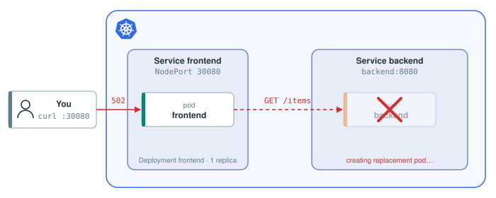
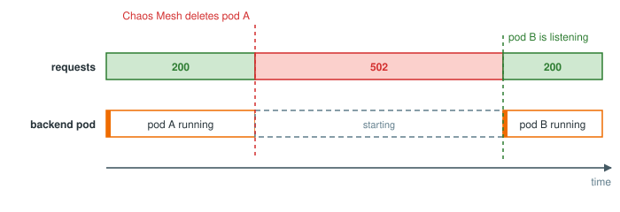
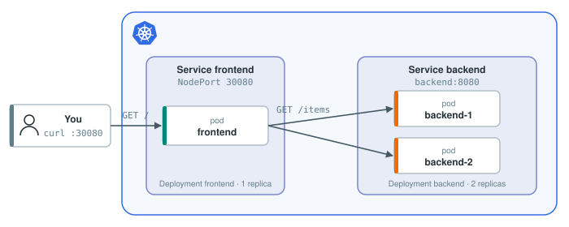
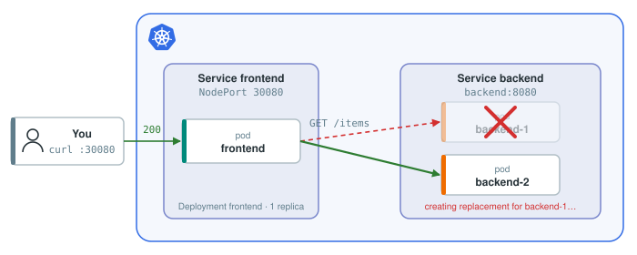

# Experiment 1: Kill the backend pod

## Hypothesis

Pods die all the time: a node is drained, a container runs out of memory. Kubernetes restarts them, so a single pod dying should not take the application down. Our hypothesis:

> **If a single backend pod dies, users do not experience downtime.**

## Measuring what the user experiences

We need to see what users see, not what Kubernetes sees. [vegeta](https://github.com/tsenart/vegeta) is a load generator: it sends requests at a constant rate for a fixed time and reports what came back. The lines that matter:

- `Success [ratio]`: the share of requests that got a 2xx response.
- `Status Codes [code:count]`: how many responses of each status; `502` means the frontend could not reach the backend.
- `Latencies`: how long requests took, as percentiles.

## Experiment


A Chaos Mesh resource kills the backend pod while vegeta sends requests to the frontend. If the hypothesis holds, the report looks the same as one taken when nothing is wrong.

### Step 1: Establish the baseline

10 seconds of traffic, 50 requests per second, nothing wrong:

```bash
echo "GET http://localhost:30080/" | vegeta attack -duration=10s | tee results.bin | vegeta report
```{{exec}}

> Success is 100% and every status code is 200: no downtime before we start.

### Step 2: Run the experiment

The experiment, saved as `/root/chaos/experiments/pod-kill.yaml`, kills one pod with the label `app=backend`:

```yaml
apiVersion: chaos-mesh.org/v1alpha1
kind: PodChaos
metadata:
  name: backend-pod-kill
spec:
  action: pod-kill
  mode: one
  selector:
    namespaces:
      - default
    labelSelectors:
      app: backend
```

Send the same traffic, and apply the experiment three seconds in so the measurement covers before, during and after:

```bash
(sleep 3; kubectl apply -f /root/chaos/experiments/pod-kill.yaml) &
echo "GET http://localhost:30080/" | vegeta attack -duration=10s | tee results.bin | vegeta report
```{{exec}}

> Success is well below 100% and there are 502s. **The hypothesis was wrong.**

### Step 3: Diagnose the issue

The diagnosis is almost trivial here: for a while there was no backend pod, so nothing could answer.



Still worth measuring how long. Group the results by second and status code:

```bash
vegeta encode --to=csv results.bin | awk -F, 'NR==1{t0=$1} {n[int(($1-t0)/1e9)" "$2]++} END{for (k in n) print k, n[k]}' | sort -n | column -t -N second,status,requests
```{{exec}}

Three seconds of 200s, several seconds of 502s, then 200s again.

<details>
<summary>As a picture</summary>



</details>

Check the state of our deployment:

```bash
kubectl get pods
```{{exec}}

> The backend pod is back, but look at `AGE`: it is seconds old.

Kubernetes did what we expect, it recreated the pod, but there was downtime in between.

### Step 4: Fix

The simplest fix is redundancy: run more than one replica, so another pod answers while the killed one is replaced.



This patch, saved as `/root/chaos/backend/patch.yaml`, adds a second pod and a readiness probe, so the replacement only gets traffic once it responds:

```yaml
spec:
  replicas: 2
  template:
    spec:
      containers:
        - name: backend
          readinessProbe:
            httpGet:
              path: /health
              port: 8080
            periodSeconds: 1
```

```bash
kubectl patch deployment backend --patch-file /root/chaos/backend/patch.yaml
kubectl rollout status deployment backend
```{{exec}}

### Step 5: Correct the hypothesis and run the experiment again

> **With two replicas, a single backend pod dying causes no downtime.**

A `PodChaos` kills once, so delete it before applying it again:

```bash
kubectl delete -f /root/chaos/experiments/pod-kill.yaml
(sleep 3; kubectl apply -f /root/chaos/experiments/pod-kill.yaml) &
echo "GET http://localhost:30080/" | vegeta attack -duration=10s | tee results.bin | vegeta report
```{{exec}}

> A pod was killed again, and this time every request succeeded: the other replica answered.



The same experiment now passes. A fix is only real once the experiment that found the problem no longer finds it.

## Reflection

In this experiment we:

- stated a very simple hypothesis,
- used Chaos Mesh to **manually** test whether it holds,
- diagnosed the issue and fixed it,
- avoided a few seconds of downtime every time a pod dies.
