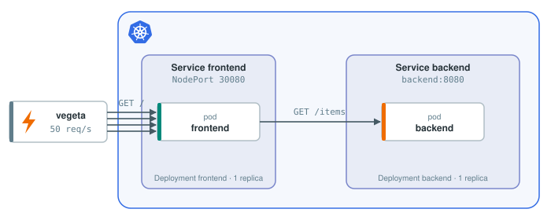
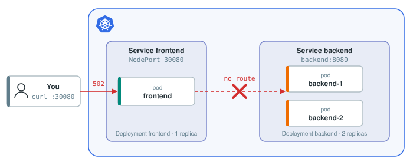

# Experiment 2: Cut the network to the backend

## Hypothesis

Network partitions are not a corner case; they are the premise of the CAP theorem, which says that during one you have to choose between staying available and staying consistent. The backend is still running, the frontend just cannot reach it. Our hypothesis:

> **If the frontend cannot reach the backend, users get an error, and everything else keeps working.**

## Experiment



A Chaos Mesh resource cuts the network from the frontend to the backend for 30 seconds while vegeta sends requests. Because hung requests are expected this time, vegeta gets a 2 second timeout per request so the attack finishes.

### Step 1: Establish the baseline

```bash
echo "GET http://localhost:30080/" | vegeta attack -duration=10s -timeout=2s | tee results.bin | vegeta report
```{{exec}}

> Success is 100% and every status code is 200.

### Step 2: Run the experiment

The experiment, saved as `/root/chaos/experiments/partition.yaml`, drops all traffic from frontend pods to backend pods for 30 seconds:

```yaml
apiVersion: chaos-mesh.org/v1alpha1
kind: NetworkChaos
metadata:
  name: frontend-backend-partition
spec:
  action: partition
  mode: all
  selector:
    namespaces:
      - default
    labelSelectors:
      app: frontend
  direction: to
  target:
    mode: all
    selector:
      namespaces:
        - default
      labelSelectors:
        app: backend
  duration: "30s"
```

Apply it three seconds into the traffic:

```bash
(sleep 3; kubectl apply -f /root/chaos/experiments/partition.yaml) &
echo "GET http://localhost:30080/" | vegeta attack -duration=10s -timeout=2s | tee results.bin | vegeta report
```{{exec}}

> From the third second on, every request times out: status code `0`, and the error set says `context deadline exceeded`. Not an error page, no answer at all. **The hypothesis was wrong.**

The partition stays on for 30 seconds from the moment it was applied, so it is still on.

<details>
<summary>Took too long? Apply the partition again</summary>

Reapply it:

```bash
kubectl delete -f /root/chaos/experiments/partition.yaml
kubectl apply -f /root/chaos/experiments/partition.yaml
```{{exec}}

To make the frontend hang, make a request that hits the backend:

```bash
curl -m 2 localhost:30080/
```{{exec}}

</details>

Ask the frontend for something that does not need the backend:

```bash
curl -m 2 localhost:30080/health
```{{exec}}

> That hangs too.

### Step 3: Diagnose the issue


Look at the backend call in the frontend code:

```python
def fetch_items():
    with urllib.request.urlopen(BACKEND) as response:
        return json.load(response)["items"]
```

`urlopen` has no timeout. The packets to the backend are dropped, so the connection attempt never completes and the call waits for as long as TCP keeps retrying, minutes. The frontend handles one request at a time, so the first user to hit the partition hogs the frontend, and nobody else gets anything, not even `/health`.

End the partition before moving on:

```bash
kubectl delete -f /root/chaos/experiments/partition.yaml
```{{exec}}

### Step 4: Fix, first attempt

The frontend serves one request at a time. The obvious fix is to serve requests concurrently, so that one stuck request does not block the others. This patch, saved as `/root/chaos/frontend/threading.patch`, gives every request its own thread:

```diff
--- a/frontend/app.py
+++ b/frontend/app.py
@@ -1,7 +1,7 @@
 import json
 import os
 import urllib.request
-from http.server import BaseHTTPRequestHandler, HTTPServer
+from http.server import BaseHTTPRequestHandler, ThreadingHTTPServer
 from textwrap import indent
 
 BACKEND = os.environ.get("BACKEND_URL", "http://backend:8080/items")
@@ -87,5 +87,5 @@
 
 
 print("listening on :8080", flush=True)
-# Single-threaded: one request at a time, like one sync worker.
-HTTPServer(("", 8080), Handler).serve_forever()
+# One thread per request.
+ThreadingHTTPServer(("", 8080), Handler).serve_forever()
```

Apply it to the code, rebuild the ConfigMap the pod reads it from, and restart the frontend:

```bash
cd /root/chaos && patch -p1 < frontend/threading.patch
kubectl create configmap frontend-code --from-file=app.py=frontend/app.py --dry-run=client -o yaml | kubectl apply -f -
kubectl rollout restart deployment frontend && kubectl rollout status deployment frontend
```{{exec}}

Run the experiment again:

```bash
(sleep 3; kubectl apply -f /root/chaos/experiments/partition.yaml) &
echo "GET http://localhost:30080/" | vegeta attack -duration=10s -timeout=2s | tee results.bin | vegeta report
```{{exec}}

> Still timeouts. Now check `/health` and count the frontend's threads:

```bash
curl -m 2 localhost:30080/health
kubectl exec deploy/frontend -- ls /proc/1/task | wc -l
```{{exec}}

> `/health` answers now, but there are hundreds of threads, one per request that is still waiting on the backend.

One user no longer blocks everyone, but every user still waits until they give up, and each of them costs the frontend a thread. With a real worker pool that is a fixed number: N stuck users and the frontend is full again. Threads changed who gets blocked, not whether.

```bash
kubectl delete -f /root/chaos/experiments/partition.yaml
```{{exec}}

### Step 5: Fix, second attempt

The call to the backend needs a limit on how long it may wait. This patch, saved as `/root/chaos/frontend/timeout.patch`, gives it half a second:

```diff
--- a/frontend/app.py
+++ b/frontend/app.py
@@ -35,7 +35,7 @@
 
 
 def fetch_items():
-    with urllib.request.urlopen(BACKEND) as response:
+    with urllib.request.urlopen(BACKEND, timeout=0.5) as response:
         return json.load(response)["items"]
 
 
```

After half a second `urlopen` raises, `index()` catches it and returns the error page, and the thread is free again.

```bash
cd /root/chaos && patch -p1 < frontend/timeout.patch
kubectl create configmap frontend-code --from-file=app.py=frontend/app.py --dry-run=client -o yaml | kubectl apply -f -
kubectl rollout restart deployment frontend && kubectl rollout status deployment frontend
```{{exec}}

Run the experiment again:

```bash
(sleep 3; kubectl apply -f /root/chaos/experiments/partition.yaml) &
echo "GET http://localhost:30080/" | vegeta attack -duration=10s -timeout=2s | tee results.bin | vegeta report
```{{exec}}

> No timeouts. During the partition every request gets a `502` within about half a second, and the frontend keeps answering.

```bash
curl -m 2 localhost:30080/health
kubectl exec deploy/frontend -- ls /proc/1/task | wc -l
```{{exec}}

> `/health` answers, and the thread count is back to a handful.



The hypothesis holds. Users see an error page while the backend is unreachable, and the frontend is usable the moment the network is back.

```bash
kubectl delete -f /root/chaos/experiments/partition.yaml
```{{exec}}

## Reflection

In this experiment we:

- stated a hypothesis about a failure Kubernetes cannot heal,
- used Chaos Mesh to **manually** test it, and found that one hung request took the whole frontend down,
- fixed it in two steps: concurrency, so one user cannot block the others, and a timeout, so nobody waits forever,
- chose consistency over availability: during a partition the frontend answers with an error rather than with data it cannot vouch for; serving the last known list instead would have been the other choice.
